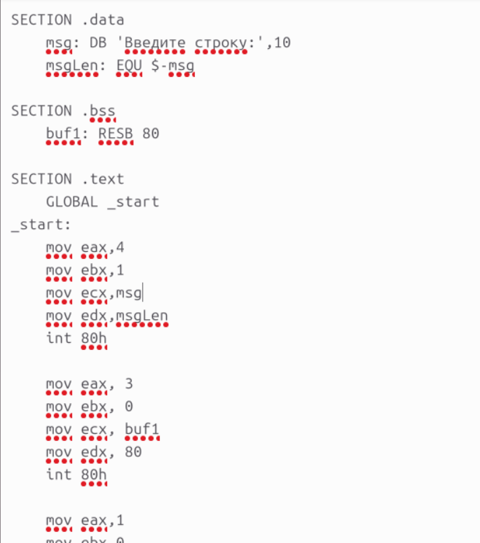
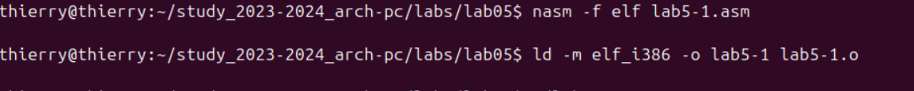
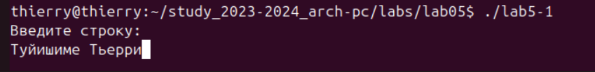
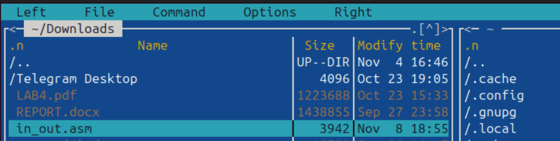
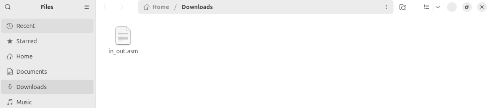
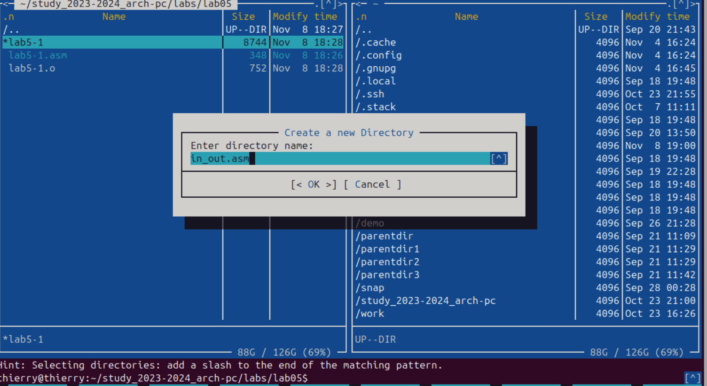
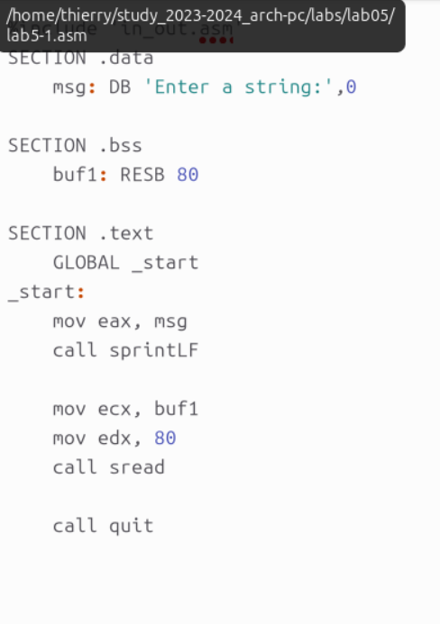
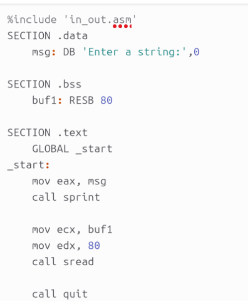
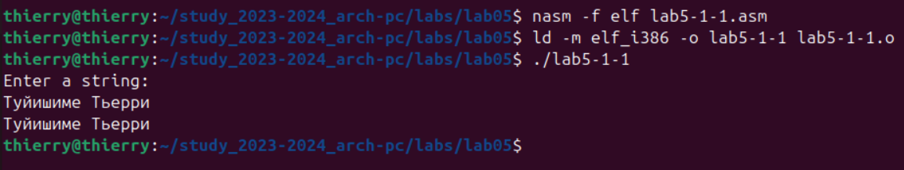

**РОССИЙСКИЙ УНИВЕРСИТЕТ ДРУЖБЫ НАРОДОВ**

**Факультет физико-математических и естественных наук**

**Кафедра прикладной информатики и теории вероятностей**

**ОТЧЕТ**

**ПО ЛАБОРАТОРНОЙ РАБОТЕ № 5**

*дисциплина: Архитектура компьютера*

**Основы работы с Midnight Commander (mc). Структура программы**

**на языке ассемблера NASM. Системные вызовы в ОС GNU Linux**

Студент: ТУЙИШИМЕ Тьерри

Группа: НКАбд-05-25

# Оглавление {#оглавление .TOC-Heading .unnumbered}

[1. Введение [3](#введение)](#введение)

[**2. Задание работы** [3](#задание-работы)](#задание-работы)

[3. Теоретическая часть [3](#теоретическая-часть)](#теоретическая-часть)

[**3,1, Структура программы на NASM**
[4](#структура-программы-на-nasm)](#структура-программы-на-nasm)

[**3.2. Системные вызовы** [4](#системные-вызовы)](#системные-вызовы)

[**4. Выполнение работы** [4](#выполнение-работы)](#выполнение-работы)

[4.1 Основы работы с Midnight Commander
[4](#основы-работы-с-midnight-commander)](#основы-работы-с-midnight-commander)

[4.2 Подключение внешнего файла
[5](#подключение-внешнего-файла)](#подключение-внешнего-файла)

[4.3 Выполнение заданий для самостоятельной работы
[6](#выполнение-заданий-для-самостоятельной-работы)](#выполнение-заданий-для-самостоятельной-работы)

[5. Выводы [7](#выводы)](#выводы)

[6. Список литературы [7](#список-литературы)](#список-литературы)

# 1. Введение {#введение .unnumbered}

Данная лабораторная работа знакомит с основами работы в операционной
системе GNU/Linux и предназначена для приобретения практических навыков
использования:

-   Файлового менеджера Midnight Commander (mc)

-   Инструкций языка ассемблера mov и int

-   Системных вызовов ядра Linux

-   Структуры программ на ассемблере NASM

-   Процесса трансляции и компоновки программ

Работа позволяет освоить основные принципы написания, отладки и
выполнения программ на языке ассемблера.

#  {#section .unnumbered}

# **2. Задание работы** {#задание-работы .unnumbered}

1.  Изучить основы работы с файловым менеджером Midnight Commander.

2.  Освоить структуру программы на языке ассемблера NASM.

3.  Научиться подключать внешние файлы с подпрограммами.

4.  Выполнить задания для самостоятельной работы:

-   Модифицировать программу для вывода вводимой пользователем строки.

-   Сравнить работу различных подпрограмм ввода-вывода.

#  {#section-1 .unnumbered}

# **3. Теоретическая часть** {#теоретическая-часть .unnumbered}

**Midnight Commander (mc)**

**Midnight Commander:** это визуальный файловый менеджер для
операционных систем Unix-like. Он предоставляет удобный текстовый
интерфейс для навигации по файловой системе, работы с файлами и
каталогами.

##  {#section-2 .unnumbered}

## **3,1, Структура программы на NASM** {#структура-программы-на-nasm .unnumbered}

Программа на ассемблере NASM typically состоит из трёх секций:

-   SECTION .data - секция инициализированных данных

-   SECTION. bss - секция неинициализированных данных

-   SECTION .text - секция кода программы

##  {#section-3 .unnumbered}

## **3.2. Системные вызовы** {#системные-вызовы .unnumbered}

Для взаимодействия с ядром ОС используются системные вызовы через
инструкцию int 80h. Основные вызовы:

-   sys_write (4) - вывод данных

-   sys_read (3) - ввод данных

-   sys_exit (1) - завершение программы

#  {#section-4 .unnumbered}

# **4. Выполнение работы** {#выполнение-работы .unnumbered}

## 4.1 Основы работы с Midnight Commander {#основы-работы-с-midnight-commander .unnumbered}

Шаг 1: открываем Midnight Commander, выполнив в терминале команду:

{width="5.166666666666667in"
height="2.923611111111111in"}

Шаг 2: переходим в каталог \~/work/study/2023-2024/\"Архитектура
Компьютера\"/arch-pc

{width="5.833333333333333in"
height="2.629166666666667in"}

Шаг 3: создаём каталог lab05 с помощью клавиши F7

{width="5.3125in" height="3.468231627296588in"}

Шаг 4: создаём файл lab5-1.asm командой:

{width="5.200834426946631in"
height="3.9166666666666665in"}

Шаг 5: открываем файл lab5-1.asm для редактирования клавишей F4

{width="5.540972222222222in" height="2.8125in"}

Шаг 6: Вводим код программы:

{width="6.728472222222222in"
height="0.6756944444444445in"}

Шаг 7: компилируем и компонуем программу:

{width="6.728472222222222in"
height="0.6756944444444445in"}

Шаг 8: запускаем исполняемый
файл:{width="6.728472222222222in"
height="0.8243055555555555in"}

## 4.2 Подключение внешнего файла {#подключение-внешнего-файла .unnumbered}

Шаг 9: скачиваем файл in_out.asm со страницы курса

{width="5.340277777777778in"
height="1.3481594488188977in"}

Шаг 10: копируем файл in_out.asm в каталог lab05 клавишей F5

{width="5.722222222222222in"
height="2.861111111111111in"}

Шаг 11: создаём копию файла lab5-1.asm с -2.asm

{width="5.173611111111111in"
height="2.513888888888889in"}

Шаг 12: Редактируем lab5-2.asm:

{width="6.089583333333334in"
height="5.416666666666667in"}

Шаг 13: компилируем и запускаем новую программу:

{width="5.451388888888889in"
height="1.312382983377078in"}

Шаг 14: изменяем sprintLF на sprint в файле lab5-2.asm

{width="4.055555555555555in"
height="4.925184820647419in"}

Шаг 15: повторно компилируем и запускаем программу

##  {#section-5 .unnumbered}

## Выполнение заданий для самостоятельной работы

Задание 1: создаём копию lab5-1.asm с именем lab5-1-1.asm

{width="5.708333333333333in" height="2.81875in"}

Задание 2: редактируем lab5-1-1.asm, добавляя вывод введенной строки:

{width="6.569444444444445in"
height="4.576388888888889in"}

Шаг 16: компилируем и запускаем программу:

{width="6.277777777777778in"
height="3.0694444444444446in"}

Задание 3: создаём копию lab5-2.asm с именем lab5-2-1.asm

{width="6.111110017497813in"
height="2.7152777777777777in"}

Задание 4: редактируем lab5-2-1.asm для вывода введенной строки:

{width="6.728472222222222in"
height="3.7152777777777777in"}

Шаг 17: компилируем и запускаем программу:

{width="6.728472222222222in"
height="1.2472222222222222in"}

# 5. Выводы {#выводы .unnumbered}

В ходе выполнения лабораторной работы:

-   Приобретены практические навыки работы с файловым менеджером
    Midnight Commander

-   Освоены инструкции языка ассемблера mov и int

-   Изучена структура программы на ассемблере NASM

-   Освоено подключение внешних файлов с подпрограммами

-   Получены навыки компиляции и компоновки программ на ассемблере

-   Изучены системные вызовы для ввода-вывода данных в ОС Linux

Работа показала практическое применение языка ассемблера для
взаимодействия с операционной системой на низком уровне.

# 6. Список литературы {#список-литературы .unnumbered}

1.  Лабораторная работа №5 - Основы работы с Midnight Commander (mc).
    Структура программы на языке ассемблера NASM. Системные вызовы в ОС
    GNU Linux

2.  NASM Documentation
