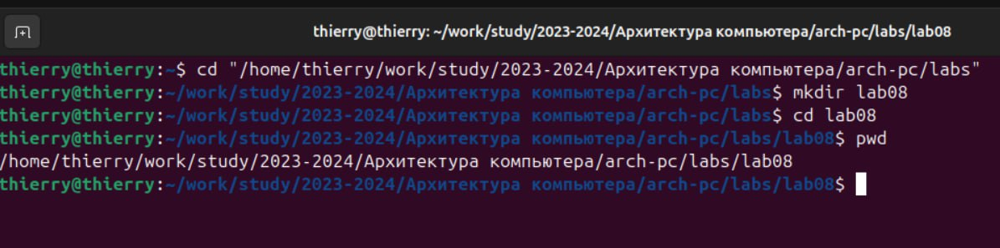
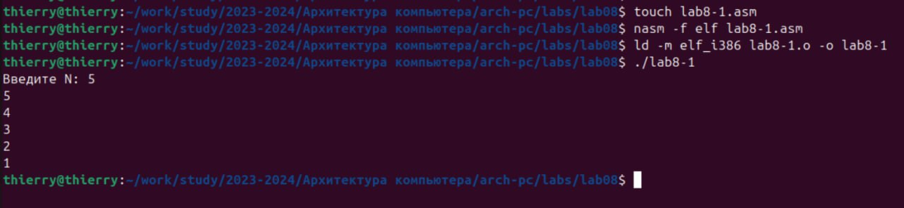
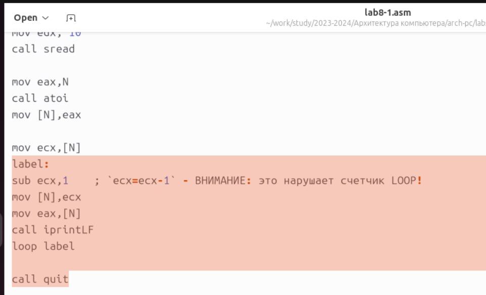
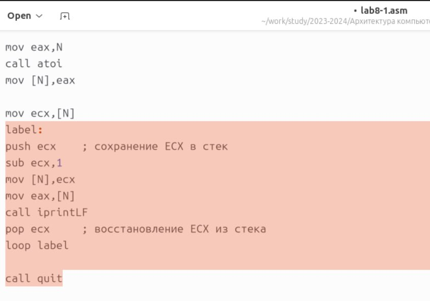
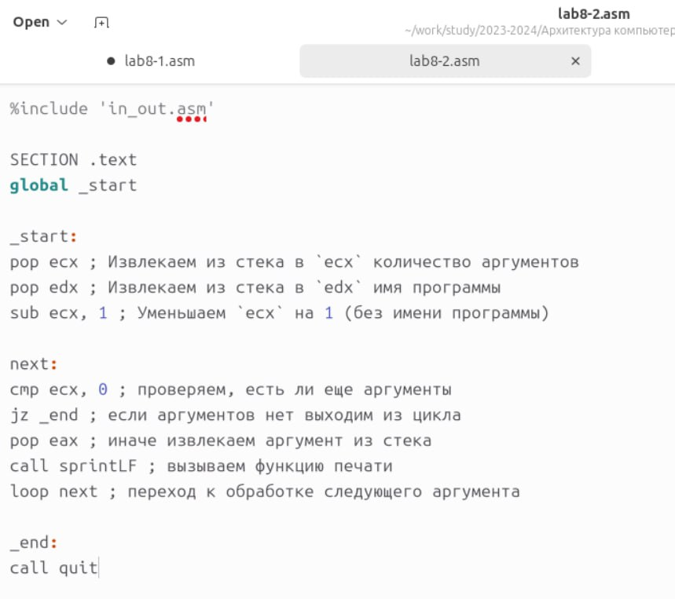
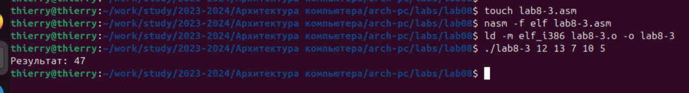
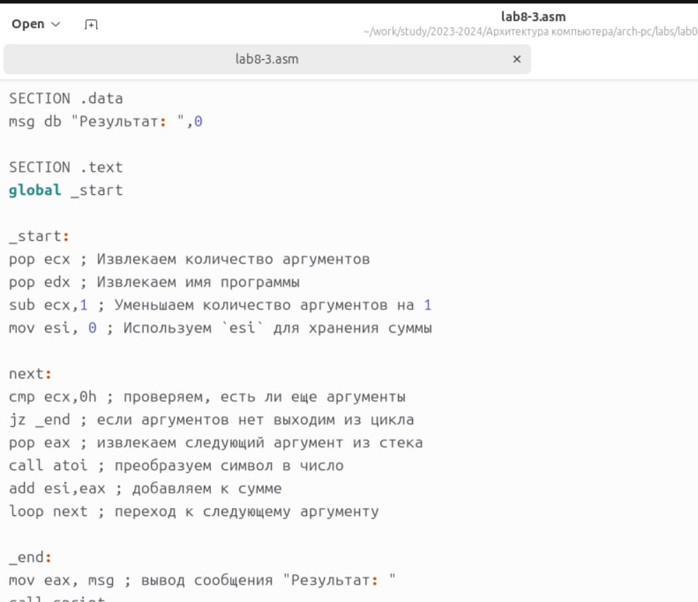
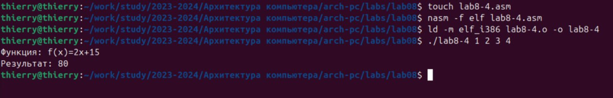
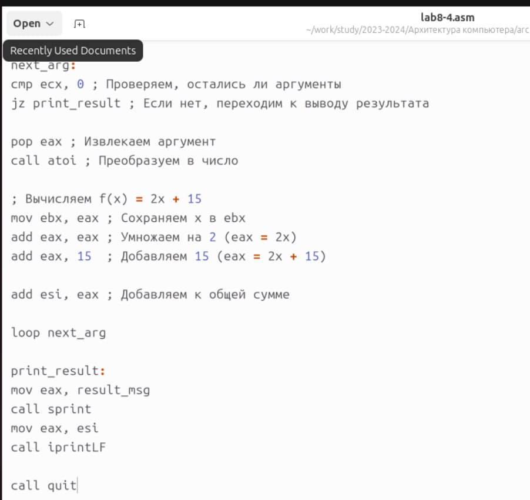
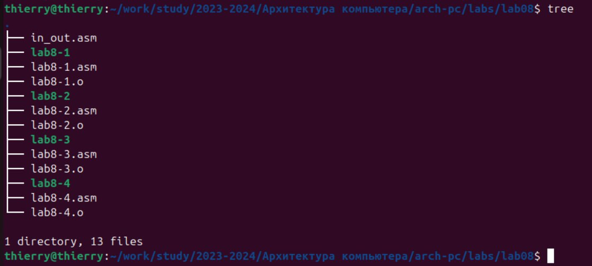

**РОССИЙСКИЙ УНИВЕРСИТЕТ ДРУЖБЫ НАРОДОВ**

**Факультет физико-математических и естественных наук**

**Кафедра прикладной информатики и теории вероятностей**

**ОТЧЕТ**

**ПО ЛАБОРАТОРНОЙ РАБОТЕ № 8**

***дисциплина: Архитектура компьютера***

**Программирование цикла. Обработка аргументов командной строки**

Студент: ТУЙИШИМЕ Тьерри

Группа: НКАбд-05-25

# Оглавление {#оглавление .TOC-Heading}

[1. Цель работы [3](#цель-работы)](#цель-работы)

[2. Теоретическое введение
[3](#теоретическое-введение)](#теоретическое-введение)

[2.1. Организация стека [3](#организация-стека)](#организация-стека)

[2.2. Инструкции организации циклов
[3](#инструкции-организации-циклов)](#инструкции-организации-циклов)

[3. Порядок выполнения лабораторной работы
[3](#порядок-выполнения-лабораторной-работы)](#порядок-выполнения-лабораторной-работы)

[3.1. Реализация циклов в NASM
[3](#реализация-циклов-в-nasm)](#реализация-циклов-в-nasm)

[4. Задание для самостоятельной работы
[7](#задание-для-самостоятельной-работы)](#задание-для-самостоятельной-работы)

[5. Содержание отчета [8](#содержание-отчета)](#содержание-отчета)

[6. Вопросы для самопроверки
[8](#вопросы-для-самопроверки)](#вопросы-для-самопроверки)

[7. Выводы [9](#выводы)](#выводы)

# 1. Цель работы

Приобретение навыков написания программ с использованием циклов и
обработкой аргументов командной строки.

#  2. Теоретическое введение

## 

##  2.1. Организация стека

Стек: структура данных по принципу LIFO (Last In --- First Out). В
архитектуре процессора стек реализован аппаратно с использованием
регистров:

-   ESP (Stack Pointer) - указатель на вершину стека

-   EBP (Base Pointer) - указатель на базу стека

**Основные операции:**

-   \`PUSH\` - добавление элемента в стек

-   \`POP\` - извлечение элемента из стека

##  2.2. Инструкции организации циклов

**Команда LOOP:**

-   Уменьшает ECX на 1

-   Если ECX ≠ 0, переход к метке

-   Если ECX = 0, продолжение выполнения

#  3. Порядок выполнения лабораторной работы

##  3.1. Реализация циклов в NASM

Шаг 1: Создание рабочего каталога

Организация рабочего пространства для лабораторной работы

{width="6.298611111111111in"
height="1.5653893263342082in"}

**Результат:** Создан каталог для файлов лабораторной работы

Шаг 2: Создание базовой программы с циклом

Изучение работы инструкции LOOP и регистра ECX

{width="6.728472222222222in"
height="1.5569444444444445in"}

Программа запрашивает число N и выводит значения от N до 1, используя
LOOP для организации цикла.

Шаг 3: Модификация с изменением ECX в цикле

Демонстрация проблемы изменения ECX в теле цикла

{width="6.728472222222222in"
height="4.081944444444445in"}

**Проблема:** LOOP также уменьшает ECX, поэтому общее уменьшение
составляет 2 за итерацию.

Шаг 4: Использование стека для сохранения ECX

Цель: Решение проблемы с использованием стека

{width="6.728472222222222in"
height="4.719444444444444in"}

Результат:Корректная работа цикла благодаря сохранению/восстановлению
ECX

3.2. Обработка аргументов командной строки

Шаг 5: Программа вывода аргументов

Цель: Изучение механизма передачи аргументов через стек

{width="6.728472222222222in" height="1.11875in"}

{width="6.728472222222222in"
height="5.976388888888889in"}

Программа демонстрирует извлечение аргументов из стека в обратном
порядке

Шаг 6: Программа вычисления суммы аргументов

Цель: Обработка числовых аргументов и вычисления

{width="6.728472222222222in"
height="0.9201388888888888in"}

{width="6.728472222222222in"
height="5.802777777777778in"}

**Результат:** Сумма аргументов 12 + 13 + 7 + 10 + 5 = 47

# 4. Задание для самостоятельной работы

**Задача**: написать программу вычисления суммы значений функции f(x)
для аргументов командной строки

**Вариант 1:** f(x) = 2x + 15

Шаг 7: Реализация программы

{width="6.728472222222222in"
height="1.0784722222222223in"}

{width="6.728472222222222in"
height="6.340277777777778in"}

Проверка вычислений:

-   f(1) = 2×1 + 15 = 17

-   f(2) = 2×2 + 15 = 19

-   f(3) = 2×3 + 15 = 21

-   f(4) = 2×4 + 15 = 23

**Сумма:**17 + 19 + 21 + 23 = 80

#  5. Содержание отчета

**Отчет должен содержать:**

-   Титульный лист с номером работы и ФИО

-   Формулировка цели работы

-   Описание результатов выполнения:

-   Описание заданий

-   Скриншоты выполнения

-   Комментарии и выводы

-   Листинги всех программ

-   Выводы, согласованные с целью

#  6. Вопросы для самопроверки

1\. Опишите работу команды Loop.

-   Уменьшает ECX на 1

-   Если ECX ≠ 0, переход к метке

-   Если ECX = 0, продолжение выполнения

2\. Как организовать цикл без LOOP?

-   Использовать CMP и условные переходы (JNE, JNZ)

3\. Дайте определение стека.

-   Структура LIFO для временного хранения данных

4\. Порядок выборки из стека?

\- Данные извлекаются в обратном порядке относительно добавления

# 7. Выводы

В ходе лабораторной работы успешно:

-   Изучены принципы организации циклов в NASM

```{=html}
<!-- -->
```
-   Освоена обработка аргументов командной строки

```{=html}
<!-- -->
```
-   Приобретены навыки работы со стеком

```{=html}
<!-- -->
```
-   Реализованы программы вычисления сумм и математических функций

```{=html}
<!-- -->
```
-   Решена задача самостоятельной работы для варианта f(x) = 2x + 15

{width="6.728472222222222in"
height="3.029861111111111in"}
