**РОССИЙСКИЙ УНИВЕРСИТЕТ ДРУЖБЫ НАРОДОВ**

**Факультет физико-математических и естественных наук**

**Кафедра прикладной информатики и теории вероятностей**

**ОТЧЕТ**

**ПО ЛАБОРАТОРНОЙ РАБОТЕ № 9**

***дисциплина: Архитектура компьютера***

Понятие подпрограммы. Отладчик GDB.

Студент: ТУЙИШИМЕ Тьерри

Группа: НКАбд-05-25

# Оглавление {#оглавление .TOC-Heading}

[1. Цель работы [3](#цель-работы)](#цель-работы)

[2. Теоретическая часть [3](#теоретическая-часть)](#теоретическая-часть)

[3. Ход работы [3](#ход-работы)](#ход-работы)

[3.1. Реализация подпрограмм в NASM
[3](#реализация-подпрограмм-в-nasm)](#реализация-подпрограмм-в-nasm)

[3.2. Отладка программы с помощью GDB
[5](#отладка-программы-с-помощью-gdb)](#отладка-программы-с-помощью-gdb)

[3.3. Обработка аргументов командной строки в GDB
[8](#обработка-аргументов-командной-строки-в-gdb)](#обработка-аргументов-командной-строки-в-gdb)

[4. Самостоятельная работа
[9](#самостоятельная-работа)](#самостоятельная-работа)

[4.1. Задание 1 [9](#задание-1)](#задание-1)

[4.2. Задание 2 [9](#задание-2)](#задание-2)

[5. Выводы [10](#section)](#section)

[6. Приложения [11](#приложения)](#приложения)

# 1. Цель работы

Приобретение навыков написания программ с использованием подпрограмм.
Знакомство с методами отладки при помощи GDB и его основными
возможностями.

# 2. Теоретическая часть

Подпрограмма --- это функционально законченный участок кода, который
можно многократно вызывать из разных мест программы. Для вызова
используется инструкция \`call\`, для возврата --- \`ret\`.

Отладка --- процесс поиска и исправления ошибок в программе. GDB (GNU
Debugger) --- отладчик, позволяющий управлять выполнением программы,
устанавливать точки останова, просматривать и изменять данные.

# 3. Ход работы

## 3.1. Реализация подпрограмм в NASM

3.1.1. Создание каталога и файла

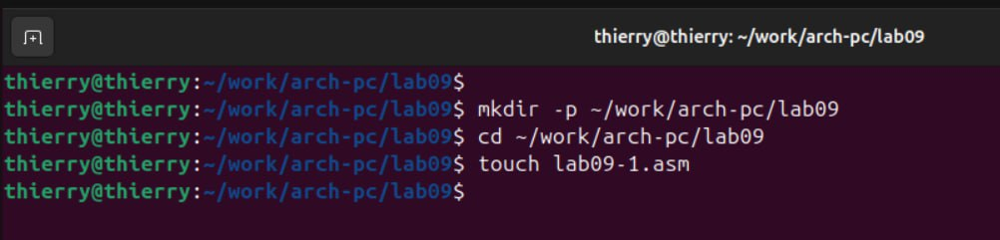{width="6.728472222222222in"
height="1.6180555555555556in"}

3.1.2. Написание программы с подпрограммой \`\_calcul\`

**Файл: \`lab09-1.asm\`**

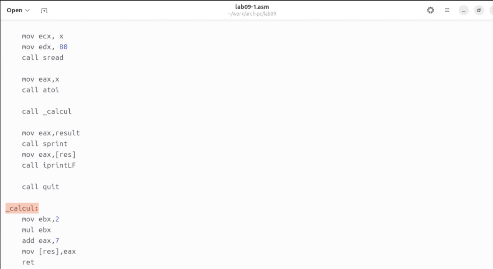{width="6.152777777777778in"
height="3.3618339895013123in"}

3.1.3. Компиляция и запуск

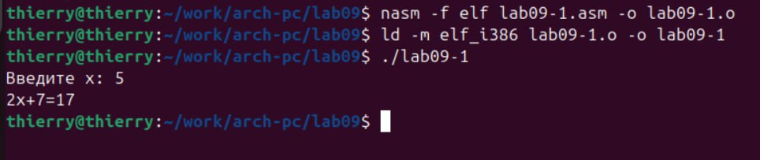{width="5.804956255468067in"
height="1.2222222222222223in"}

## 3.2. Отладка программы с помощью GDB

3.2.1. Создание файла \`lab09-2.asm\`

**Файл: \`lab09-2.asm\`**

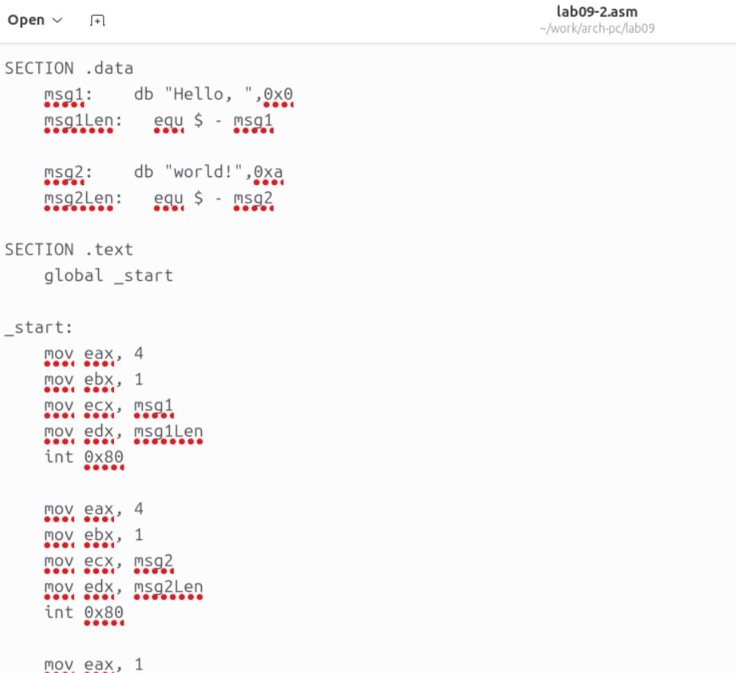{width="5.748818897637795in"
height="5.256944444444445in"}

3.2.2. Компиляция с отладочной информацией

{width="6.728472222222222in"
height="0.8395833333333333in"}

3.2.3. Запуск GDB

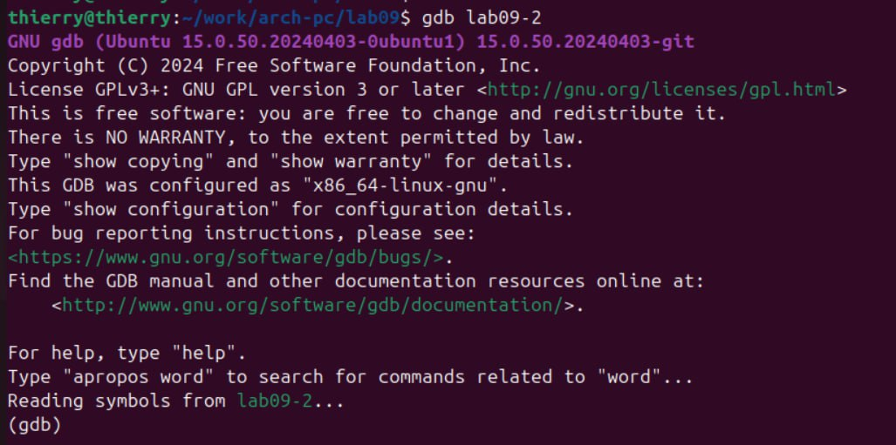{width="6.728472222222222in"
height="3.347916666666667in"}

3.2.4. Установка точки останова и запуск программы

{width="6.194444444444445in"
height="2.6551268591426074in"}

3.2.5. Дизассемблирование

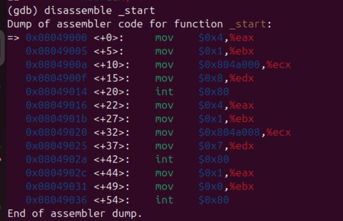{width="5.364288057742782in"
height="3.4652777777777777in"}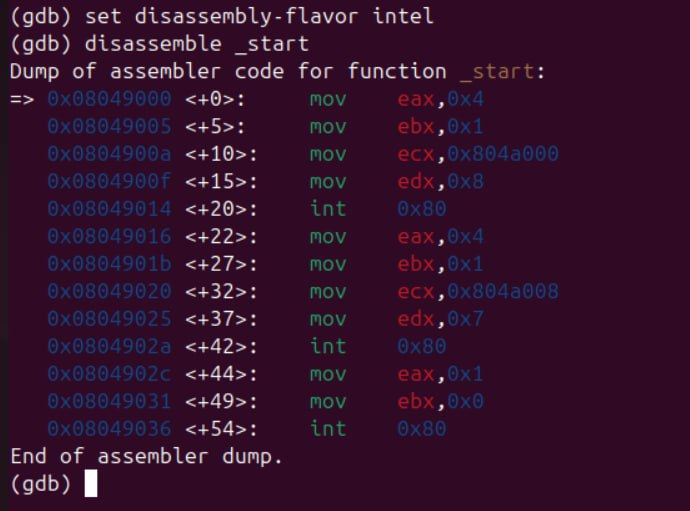{width="5.388888888888889in"
height="4.186805555555556in"}

3.2.6. Установка второй точки останова

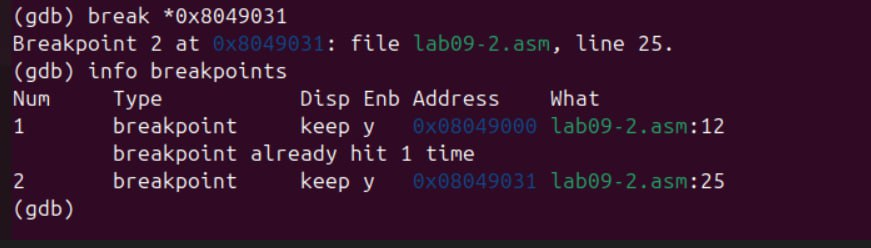{width="5.560318241469816in"
height="1.5833333333333333in"}

3.2.7. Пошаговое выполнение и просмотр регистров

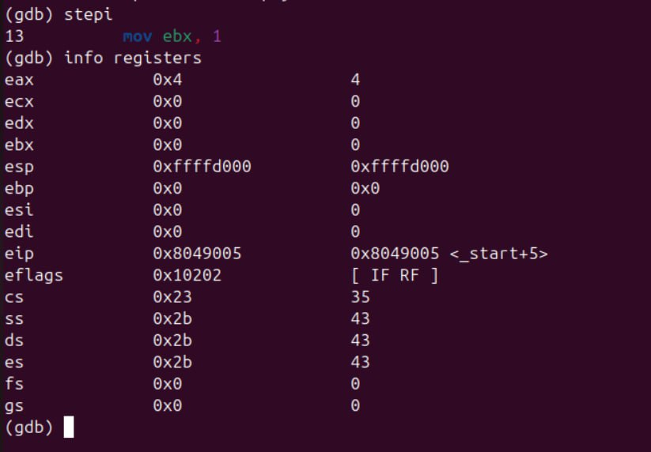{width="6.728472222222222in"
height="4.676388888888889in"}

3.2.8. Просмотр памяти

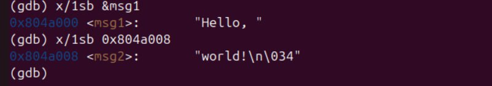{width="6.728472222222222in"
height="1.1840277777777777in"}

3.2.9. Изменение данных в памяти

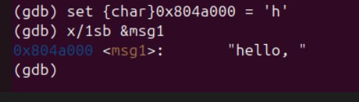{width="3.8472222222222223in"
height="1.0992060367454068in"}

3.2.10. Изменение регистров

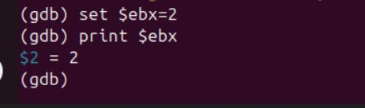{width="4.813171478565179in"
height="1.4272823709536309in"}

## 3.3. Обработка аргументов командной строки в GDB

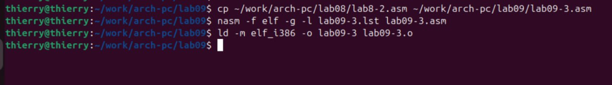{width="6.728472222222222in"
height="0.9430555555555555in"}

3.3.2. Запуск GDB с аргументами

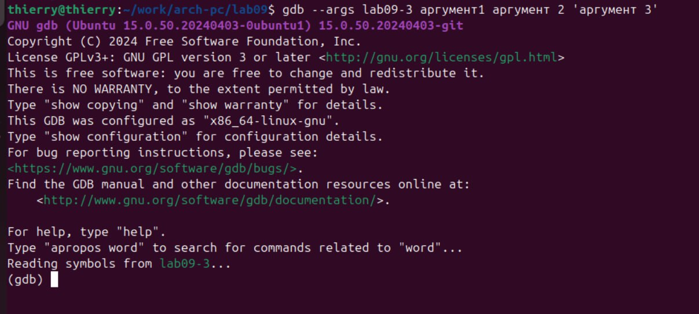{width="5.762419072615923in"
height="2.5972222222222223in"}

3.3.3. Исследование стека аргументов

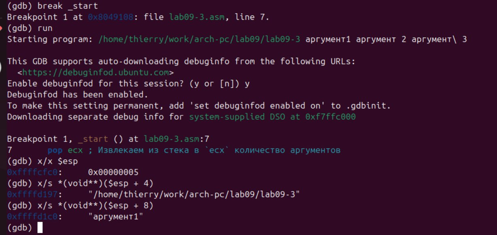{width="6.728472222222222in"
height="3.191666666666667in"}

**Вывод**: Шаг изменения адреса равен 4, потому что в 32-битной
архитектуре размер указателя 4 байта.

# 4. Самостоятельная работа

## 4.1. Задание 1 

Преобразование программы из лабораторной работы №8 с использованием
подпрограммы для вычисления функции.

**(Программа представлена в приложении)**

## 4.2. Задание 2 

Отладка программы вычисления \`(3+2)\*4+5\`.

**Файл: \`lab09-fix.asm\`**

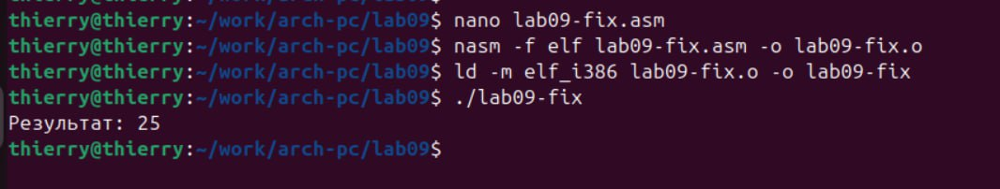{width="6.728472222222222in"
height="3.1326388888888888in"}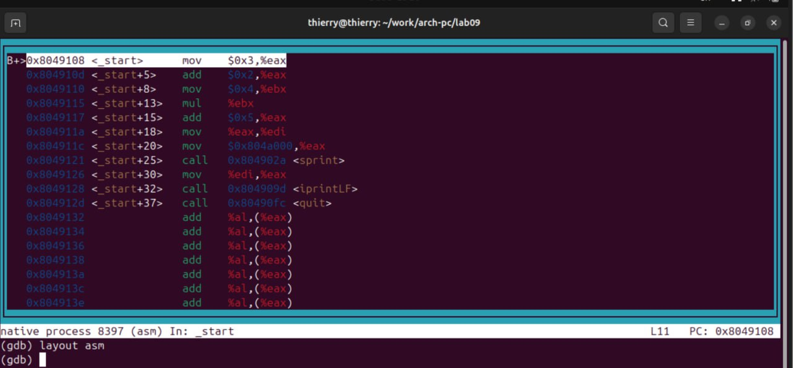{width="6.728472222222222in"
height="2.734722222222222in"}

**Исправление:**Ошибка была в некорректном использовании регистров.
После \`mul ecx\` результат хранится в \`eax\`, а не в \`ebx\`.

#  

# 

# 5. Выводы

В ходе работы были изучены:

-   Принципы написания подпрограмм на ассемблере NASM.

-   Основы работы с отладчиком GDB.

-   Установка точек останова, пошаговое выполнение, просмотр и изменение
    регистров и памяти.

-   Анализ стека аргументов командной строки.

Навыки, полученные в лабораторной работе, позволяют эффективно
отлаживать и оптимизировать ассемблерные программы.

#  6. Приложения

Исходные файлы:

-   \`lab09-1.asm\`

-   \`lab09-2.asm\`

-   \`lab09-3.asm\`

-   \`lab09-fix.asm\`

-   Скриншоты выполнения

-   Листинги программ
