**РОССИЙСКИЙ УНИВЕРСИТЕТ ДРУЖБЫ НАРОДОВ**

**Факультет физико-математических и естественных наук**

**Кафедра прикладной информатики и теории вероятностей**

**ОТЧЕТ ПО ЛАБОРАТОРНОЙ РАБОТЕ № 6**

***дисциплина: Архитектура компьютера***

**Освоение арифметических инструкций языка ассемблера NASM**

**Студент: ТУЙИШИМЕ Тьерри**

**Группа: НКАбд-05-25**

# Оглавление {#оглавление .TOC-Heading}

[1. Цель работы [3](#цель-работы)](#цель-работы)

[2. Задание [3](#задание)](#задание)

[3. Теоретическое введение
[3](#теоретическое-введение)](#теоретическое-введение)

[4. Выполнение лабораторной работы
[4](#выполнение-лабораторной-работы)](#выполнение-лабораторной-работы)

[4.1 Символьные и численные данные в NASM
[4](#символьные-и-численные-данные-в-nasm)](#символьные-и-численные-данные-в-nasm)

[4.2 Выполнение арифметических операций в NASM
[8](#выполнение-арифметических-операций-в-nasm)](#выполнение-арифметических-операций-в-nasm)

[4.3 Вопросы по программе
[11](#вопросы-по-программе)](#вопросы-по-программе)

[4.4 Задание для самостоятельной работы
[12](#задание-для-самостоятельной-работы)](#задание-для-самостоятельной-работы)

[5. Выводы [14](#выводы)](#выводы)

[6. Список литературы [14](#список-литературы)](#список-литературы)

# 1. Цель работы

Освоение арифметических инструкций языка ассемблера NASM. Изучение
принципов работы с символьными и численными данными, выполнение базовых
арифметических операций и преобразований между различными форматами
данных.

# 2. Задание

1\. Изучить символьные и численные данные в NASM, включая различия в их
обработке.

2\. Выполнить арифметические операции в NASM с использованием различных
типов данных.

3\. Реализовать программу для вычисления арифметического выражения в
рамках задания для самостоятельной работы.

4\. Изучить принципы ввода-вывода данных и их преобразования между ASCII
и числовым представлением.

# 3. Теоретическое введение

Ассемблер NASM предоставляет низкоуровневый доступ к процессору и
памяти, что требует глубокого понимания способов адресации и обработки
данных.

**Основные способы адресации:**

Регистровая адресация: операнды хранятся в регистрах процессора
(например, \`mov ax, bx\`). Это наиболее быстрый способ обработки
данных.

Непосредственная адресация :значение операнда задается непосредственно в
команде (например, \`mov ax, 2\`). Используется для константных
значений.

Адресация памяти: операнд указывает на адрес в памяти. Требует больше
времени для выполнения, но позволяет работать с большими объемами
данных.

**Особенности работы с данными в NASM:**

Ввод и вывод информации в NASM осуществляются в символьном виде с
использованием кодировки ASCII. Это создает необходимость преобразования
данных между символьным и числовым представлениями.

**Критически важные моменты**

-   При выводе числа без преобразования оно интерпретируется как
    последовательность ASCII-символов

-   Для корректных арифметических операций необходимо преобразовывать
    введенные символы в числа

-   Функции вроде \`atoi\` (ASCII to integer) и \`iprint\` (integer
    print) обеспечивают это преобразование

#  4. Выполнение лабораторной работы

## 4.1 Символьные и численные данные в NASM

**Шаг 1: Создание рабочей среды**

1\. Создайте директорию для лабораторной работы:

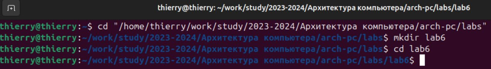{width="5.465277777777778in"
height="1.0555555555555556in"}

создание директории и переход в неё.

2\. Создайте файл \`lab6-1.asm\`:

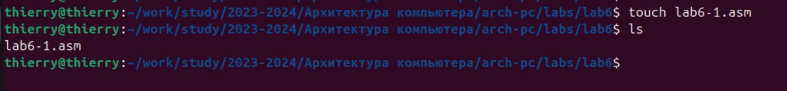{width="6.0625in"
height="0.7847222222222222in"}создание файла и проверка его наличия.

3\. Скопируйте файл \`in_out.asm\` в текущую директорию:

{width="4.682614829396326in"
height="1.1666666666666667in"}

копирование файла.

**Шаг 2: Демонстрация различий символьных и численных данных**

1\. Откройте файл \`lab6-1.asm\` и введите следующий код:

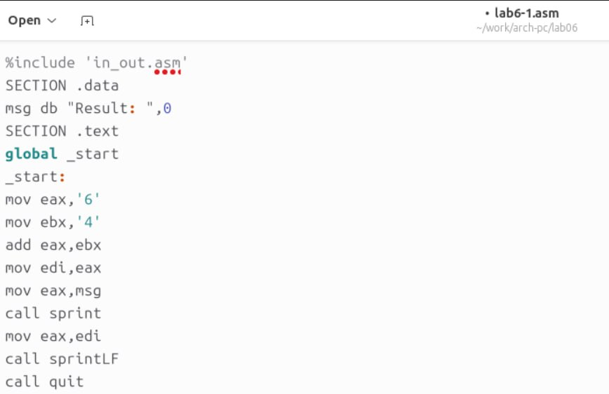{width="5.173611111111111in"
height="3.3501126421697287in"}

редактирование файла.

2\. Создайте исполняемый файл и запустите его:

{width="5.398689851268592in"
height="0.6597222222222222in"}

запуск программы и вывод символа \'j\'.

ASCII-код 106 соответствует символу \'j\'

3\. Измените символы на числа в файле \`lab6-1.asm\`:

{width="4.175017497812774in"
height="3.2916666666666665in"}

изменение кода.

4\. Создайте и запустите новый исполняемый файл:

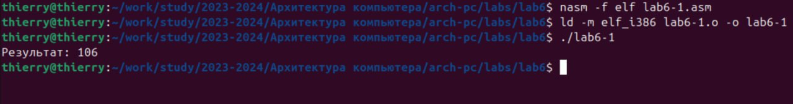{width="5.677148950131234in" height="0.75in"}

Сделайте скриншот: вывод пустой строки (символ перевода строки с кодом
10).

**Шаг 3: Программа с корректным выводом чисел**

1\. Создайте файл \`lab6-2.asm\`:

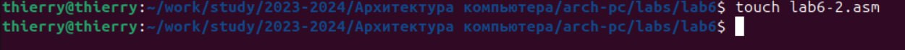{width="5.256944444444445in"
height="0.4513888888888889in"}

создание файла.

2\. Введите в файл следующий код:

{width="4.678739063867017in"
height="2.9166666666666665in"}

редактирование файла.

3\. Создайте и запустите исполняемый файл:

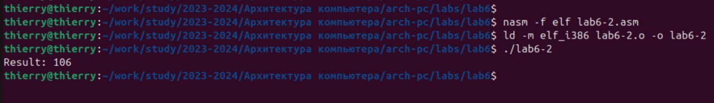{width="5.765904418197725in"
height="0.8402777777777778in"}

вывод числа 106.

4\. Замените символы на числа в файле \`lab6-2.asm\`:

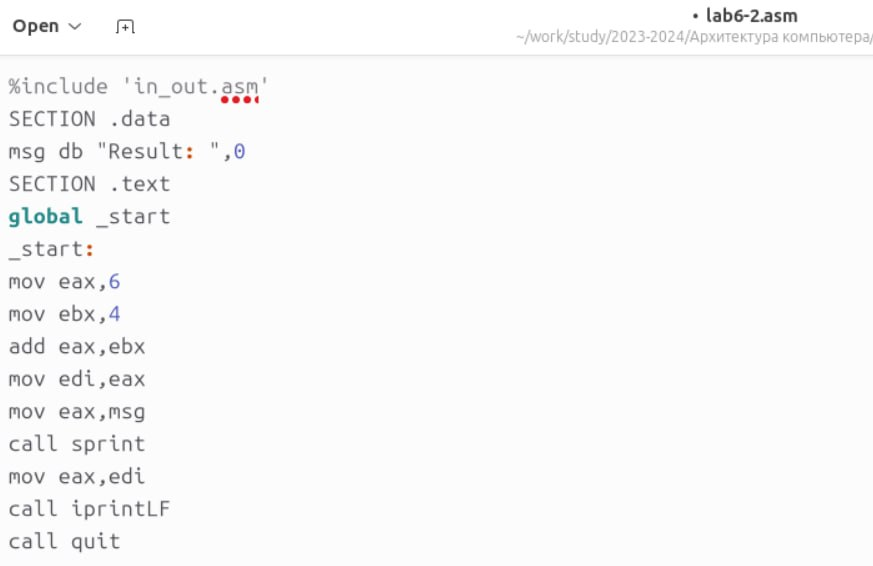{width="4.680582895888014in"
height="3.0347222222222223in"}

изменение кода.

5\. Создайте и запустите новый исполняемый файл:

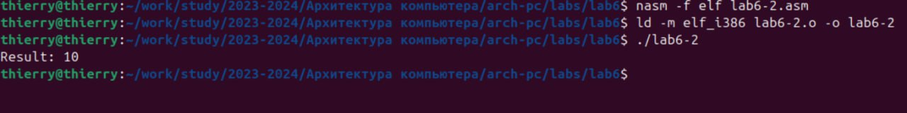{width="5.708333333333333in"
height="0.7187707786526684in"}

вывод числа 10.

6\. Замените \`iprintLF\` на \`iprint\` в файле \`lab6-2.asm\`:

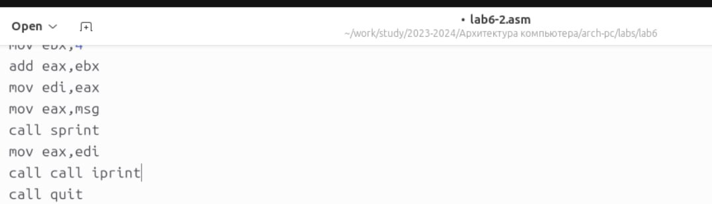{width="5.934758311461067in"
height="1.7083333333333333in"}

изменение кода.

7\. Создайте и запустите новый исполняемый файл:

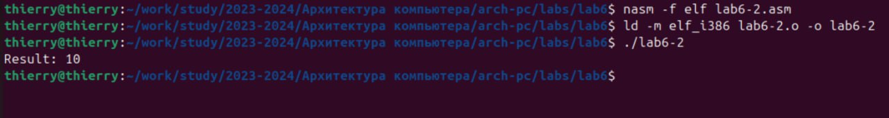{width="5.361111111111111in"
height="0.7187620297462817in"}

вывод числа 10 без перевода строки.

## 4.2 Выполнение арифметических операций в NASM

**Шаг 1: Программа вычисления арифметического выражения**

1\. Создайте файл \`lab6-3.asm\`:

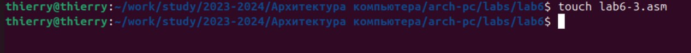{width="6.756944444444445in"
height="0.5230369641294839in"}

создание файла.

2\. Введите в файл следующий код для вычисления f(x) = (5 \* 2 + 3)/3:

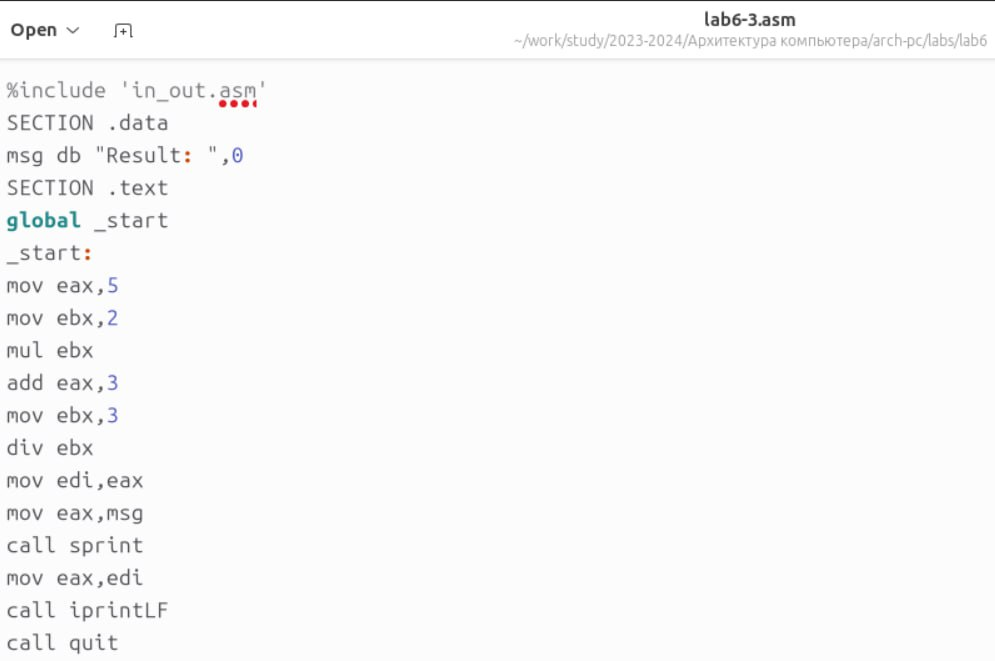{width="4.9658552055993in"
height="3.298611111111111in"}

редактирование файла.

3\. Создайте и запустите исполняемый файл:

{width="5.9375in" height="0.750077646544182in"}

вывод результата вычисления (4).

4\. Измените программу для вычисления выражения \` (4 \* 6 + 2) / 5\`:

{width="5.244645669291339in"
height="3.6597222222222223in"}

изменение кода.

5\. Создайте и запустите новый исполняемый файл:

{width="6.728472222222222in" height="0.5125in"}

вывод результата вычисления (5).

**Программа вычисления варианта задания**

1.  Создайте файл \`variant.asm\`:

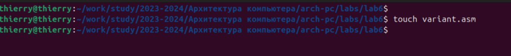{width="6.728472222222222in" height="0.74375in"}

создание файла.

2\. Введите в файл следующий код:

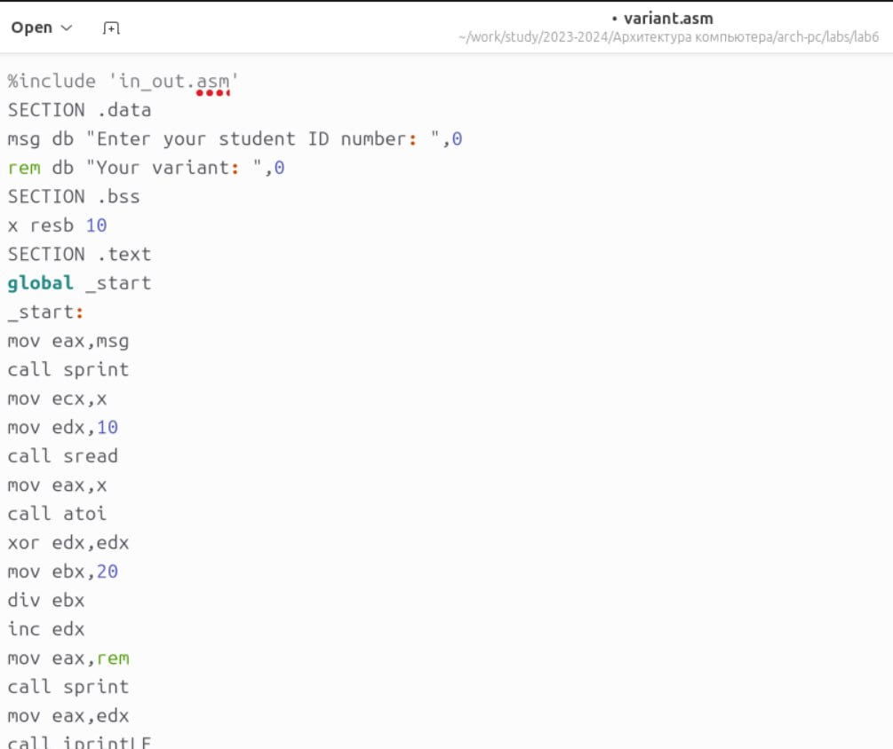{width="5.354166666666667in"
height="4.495974409448819in"}

редактирование файла.

3\. Создайте и запустите исполняемый файл:

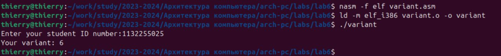{width="6.728472222222222in"
height="0.7583333333333333in"}

ввод номера студенческого билета и вывод варианта.

##  4.3 Вопросы по программе

Анализ программы variant.asm:

1\. Вывод сообщения \"Ваш вариант\"

-   **mov eax, rem**

-   **call sprint**

использование функции sprint для вывода строки\*

2, Организация ввода данных:

-   mov ecx, x -- загрузка адреса буфера для вводимой строки

```{=html}
<!-- -->
```
-   mov edx, 80 -- установка максимальной длины ввода

```{=html}
<!-- -->
```
-   call sread -- вызов функции чтения строки

3.Преобразование данных:

-   call atoi -- преобразует ASCII-строку в целое число

4\. Вычисление варианта:

-   xor edx,edx

-   mov ebx,20

-   div ebx

-   inc edx

алгоритм равномерного распределения вариантов

5\. Особенности операции div:

-   При \`div ebx\` остаток сохраняется в регистре edx

6\. Инструкция inc:

-   \`inc edx\` -- увеличивает значение регистра на 1

7\. Вывод результата:

-   mov eax,edx

-   call iprintLF

## 4.4 Задание для самостоятельной работы

**Шаг 1: Создание программы для вычисления выражения 5(x - 1)²**

1\. Создайте файл \`lab6-4.asm\`:

{width="6.728472222222222in"
height="0.4777777777777778in"}

создание файла.

создание программы для индивидуального задания\*

2\. Введите в файл следующий код:

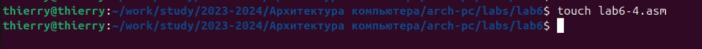{width="4.868634076990376in"
height="3.0208333333333335in"}

редактирование файла.

3\. Создайте и запустите исполняемый файл:

ввод значения 3 и вывод результата 20.

проверка корректности вычислений (5\*(3-1)² = 5\*4 = 20)

4\. Проверьте программу с другим значением:

{width="6.728472222222222in"
height="0.7402777777777778in"}

ввод значения 5 и вывод результата 80.

дополнительная проверка (5\*(5-1)² = 5\*16 = 80)

#  5. Выводы

В ходе выполнения лабораторной работы были достигнуты следующие
результаты:

**1. Освоены арифметические инструкции:** языка ассемблера NASM, включая
сложение, вычитание, умножение и деление.

**2. Изучены различия:** между символьными и численными данными, а также
принципы их преобразования с помощью функций \`atoi\` и \`iprint\`.

**3. Реализованы программы:** различной сложности - от простых
арифметических операций до интерактивных приложений с пользовательским
вводом.

**4. Освоены принципы работы:** с функциями ввода-вывода из внешнего
файла \`in_out.asm\`.

**5.Получен практический опыт:** отладки ассемблерных программ и анализа
результатов выполнения.

Работа продемонстрировала важность понимания низкоуровневых операций для
эффективного программирования на ассемблере и необходимость тщательного
контроля за форматом данных при выполнении арифметических операций.

# 6. Список литературы

1\. Лабораторная работа №6 - Методические указания

2\. NASM Documentation - Official NASM Manual

3\. Assembly Language Programming - Fundamentals and Techniques
